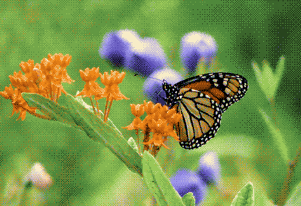

# `dithr`

[](https://crates.io/crates/dithr)

| Original | Dithered |
| --- | --- |
|  |  |

_Before (left) and after (right) using `yliluoma_2_in_place`._

Buffer-first rust dithering and halftoning library.

Quantizing grayscale/RGB/RGBA buffers without dithering creates visible
banding and contouring. `dithr` provides deterministic ordered dithering,
diffusion, stochastic binary methods, palette-constrained workflows, and
advanced halftoning methods over typed mutable slices.

### Overview

- **Buffer-first API**: Works directly on mutable pixel slices with explicit
  width, height, and stride.
- **Typed formats**: Supports `u8`, `u16`, and `f32` sample types across Gray,
  Rgb, and Rgba layouts.
- **Quantization control**: Uses `QuantizeMode` for grayscale levels, RGB
  levels, palette mapping, or single-color workflows.
- **Broad algorithm coverage**: Includes stochastic, ordered,
  palette-oriented ordered, diffusion, variable diffusion, and advanced
  halftoning families.
- **Palette workflow**: Includes `Palette<S>` and `IndexedImage<S>` for
  constrained output and indexed results.
- **Optional integrations**: `image` adapters for `DynamicImage` workflows and
  `rayon` parallel wrappers for selected families.

### Installation

```bash
cargo add dithr
```

```toml
[dependencies]
dithr = "0.2.0"
```

```bash
cargo add dithr --features image
cargo add dithr --features rayon
```

### Quick Start

```rust
use dithr::{gray_u8, QuantizeMode, Result};
use dithr::ordered::bayer_8x8_in_place;

fn main() -> Result<()> {
    let width = 64_usize;
    let height = 64_usize;
    let mut data = Vec::with_capacity(width * height);

    for y in 0..height {
        for x in 0..width {
            let value = ((x + y * width) * 255 / (width * height - 1)) as u8;
            data.push(value);
        }
    }

    let mut buffer = gray_u8(&mut data, width, height, width)?;
    bayer_8x8_in_place(&mut buffer, QuantizeMode::gray_bits(1)?)?;

    assert!(data.iter().all(|&v| v == 0 || v == 255));
    Ok(())
}
```

### Core Data Model

`dithr` is organized around a small set of types that are shared across
algorithm families.

- **`Buffer<'a, S, L>`**: Mutable typed view of image data (`S` = sample type,
  `L` = layout).
- **`BufferKind` / `PixelFormat`**: Runtime format metadata (`PixelFormat` is
  an alias of `BufferKind`).
- **`Palette<S>`**: Palette storage for fixed-color workflows (1 to 256
  entries).
- **`IndexedImage<S>`**: Indexed output (`Vec<u8>` indices) paired with a typed
  palette.
- **`QuantizeMode<'a, S>`**: Common quantization target model used by
  ordered/diffusion/stochastic/dot/Riemersma families.
- **`Error` / `Result<T>`**: Crate-level error and result surface.

### Typed Buffers, Sample Types, and Layouts

Supported runtime kinds:

- `Gray8`, `Rgb8`, `Rgba8`
- `Gray16`, `Rgb16`, `Rgba16`
- `Gray32F`, `Rgb32F`, `Rgba32F`

Typed buffer aliases:

- `GrayBuffer8`, `RgbBuffer8`, `RgbaBuffer8`
- `GrayBuffer16`, `RgbBuffer16`, `RgbaBuffer16`
- `GrayBuffer32F`, `RgbBuffer32F`, `RgbaBuffer32F`

Constructor helpers:

- Gray: `gray_u8`, `gray_u16`, `gray_32f`
- Rgb: `rgb_u8`, `rgb_u16`, `rgb_32f`
- Rgba: `rgba_u8`, `rgba_u16`, `rgba_32f`
- Packed variants: `gray_u8_packed`, `rgb_u16_packed`, `rgba_32f_packed`, etc.

Generic constructors remain available on `Buffer`:

- `Buffer::new_typed(...)`
- `Buffer::new_packed_typed(...)`
- Compatibility constructors with runtime kind checking:
  - `Buffer::new(...)`
  - `Buffer::new_packed(...)`

### Choosing a Quantization Mode

`QuantizeMode<'a, S>` is the canonical quantization model:

- `GrayLevels(u16)`
- `RgbLevels(u16)`
- `Palette(&Palette<S>)`
- `SingleColor { fg: [S; 3], levels: u16 }`

Convenience constructors:

- Generic:
  - `QuantizeMode::gray_levels(levels)`
  - `QuantizeMode::rgb_levels(levels)`
  - `QuantizeMode::palette(&palette)`
  - `QuantizeMode::single_color(fg, levels)`
- `u8` compatibility helpers:
  - `QuantizeMode::gray_bits(bits)`
  - `QuantizeMode::rgb_bits(bits)`
- Shared conversion helper:
  - `levels_from_bits(bits)`

Use `GrayLevels`/`gray_bits` when output should be grayscale levels,
`RgbLevels`/`rgb_bits` for uniform per-channel color quantization, `Palette`
for strict membership in a fixed color set, and `SingleColor` for
foreground-scaled tonal output.

### Dithering and Halftoning Method Families

#### Binary stochastic

Fast binary dithering with fixed or randomized threshold behavior.

- `threshold_binary_in_place`
- `random_binary_in_place`

Parallel variants (`rayon` feature):

- `threshold_binary_in_place_par`
- `random_binary_in_place_par`

#### Ordered methods

Deterministic threshold-map methods with predictable structure and
straightforward benchmarking.

Bayer:

- `bayer_2x2_in_place`
- `bayer_4x4_in_place`
- `bayer_8x8_in_place`
- `bayer_16x16_in_place`

Cluster-dot:

- `cluster_dot_4x4_in_place`
- `cluster_dot_8x8_in_place`
- `void_and_cluster_in_place`

Custom map:

- `custom_ordered_in_place`

Parallel variants (`rayon` feature):

- `bayer_2x2_in_place_par`
- `bayer_4x4_in_place_par`
- `bayer_8x8_in_place_par`
- `bayer_16x16_in_place_par`
- `cluster_dot_4x4_in_place_par`
- `cluster_dot_8x8_in_place_par`
- `custom_ordered_in_place_par`

#### Palette-oriented ordered (Yliluoma)

Ordered methods designed for fixed-palette workflows.

- `yliluoma_1_in_place`
- `yliluoma_2_in_place`
- `yliluoma_3_in_place`

#### Classic diffusion

Scanline error diffusion kernels for higher local tonal quality.

- `floyd_steinberg_in_place`
- `false_floyd_steinberg_in_place`
- `jarvis_judice_ninke_in_place`
- `stucki_in_place`
- `burkes_in_place`
- `sierra_in_place`
- `two_row_sierra_in_place`
- `sierra_lite_in_place`
- `stevenson_arce_in_place`
- `atkinson_in_place`

#### Extended diffusion

Additional diffusion kernels with different spread patterns.

- `fan_in_place`
- `shiau_fan_in_place`
- `shiau_fan_2_in_place`

#### Variable diffusion

Tone-dependent coefficient families.

- `ostromoukhov_in_place`
- `zhou_fang_in_place`
- `gradient_based_error_diffusion_in_place`
- `multiscale_error_diffusion_in_place`
- `feature_preserving_msed_in_place`
- `green_noise_msed_in_place`
- `adaptive_vector_error_diffusion_in_place`

Scope note: variable diffusion methods are grayscale-only except
`adaptive_vector_error_diffusion_in_place`, which supports Rgb/Rgba with alpha
preservation on Rgba.

#### Advanced halftoning

Specialized methods with narrower scope than the ordered/diffusion baseline.

- `riemersma_in_place`
- `knuth_dot_diffusion_in_place`
- `optimized_dot_diffusion_in_place`
- `direct_binary_search_in_place`
- `lattice_boltzmann_in_place`
- `electrostatic_halftoning_in_place`

Scope notes:

- `direct_binary_search_in_place`, `lattice_boltzmann_in_place`, and
  `electrostatic_halftoning_in_place` require integer grayscale buffers.
- `riemersma_in_place`, `knuth_dot_diffusion_in_place`, and
  `optimized_dot_diffusion_in_place` support Gray/Rgb/Rgba layouts, with alpha
  preserved for Rgba paths.

### Palette Workflow

`dithr` keeps palette workflows explicit: define a palette, dither into it, and
optionally build indexed output.

```rust
use dithr::{rgb_u8, IndexedImage, Palette, Result};
use dithr::ordered::yliluoma_1_in_place;

fn main() -> Result<()> {
    let width = 32_usize;
    let height = 32_usize;
    let mut data = vec![0_u8; width * height * 3];

    for y in 0..height {
        for x in 0..width {
            let i = (y * width + x) * 3;
            data[i] = (x * 255 / (width - 1)) as u8;
            data[i + 1] = (y * 255 / (height - 1)) as u8;
            data[i + 2] = ((x + y) * 255 / (width + height - 2)) as u8;
        }
    }

    let palette = Palette::new(vec![
        [0, 0, 0],
        [255, 255, 255],
        [255, 0, 0],
        [0, 0, 255],
    ])?;

    let mut buffer = rgb_u8(&mut data, width, height, width * 3)?;
    yliluoma_1_in_place(&mut buffer, &palette)?;

    let mut indices = Vec::with_capacity(width * height);
    for px in data.chunks_exact(3) {
        indices.push(palette.nearest_rgb_index([px[0], px[1], px[2]]) as u8);
    }

    let indexed = IndexedImage::new(indices, width, height, palette)?;
    assert_eq!(indexed.len(), width * height);

    Ok(())
}
```

Built-in palette helpers are also exported:

- `cga_palette()`
- `grayscale_2()`
- `grayscale_4()`
- `grayscale_16()`

### Optional image Integration

Enable `image` to adapt `image` crate buffers into `dithr` buffers.

Typed adapters:

- `gray8_image_as_buffer`
- `rgb8_image_as_buffer`
- `rgba8_image_as_buffer`
- `gray16_image_as_buffer`
- `rgb16_image_as_buffer`
- `rgba16_image_as_buffer`
- `rgb32f_image_as_buffer`
- `rgba32f_image_as_buffer`

Dynamic adapter:

- `dynamic_image_as_buffer(&mut image::DynamicImage) -> Result<DynamicImageBuffer<'_>>`

Dynamic variants:

- `DynamicImageBuffer::Gray8`
- `DynamicImageBuffer::Rgb8`
- `DynamicImageBuffer::Rgba8`
- `DynamicImageBuffer::Gray16`
- `DynamicImageBuffer::Rgb16`
- `DynamicImageBuffer::Rgba16`
- `DynamicImageBuffer::Rgb32F`
- `DynamicImageBuffer::Rgba32F`

`DynamicImage::ImageLumaA8` and `DynamicImage::ImageLumaA16` are promoted to
`DynamicImageBuffer::Rgba8` and `DynamicImageBuffer::Rgba16` during adaptation.

Current manifest configuration enables PNG and JPEG codecs for the optional
`image` dependency.

### Optional rayon Integration

Enable `rayon` for parallel wrappers where available.

Parallelized families:

- Ordered: all `*_in_place_par` ordered wrappers
- Yliluoma: `yliluoma_1_in_place_par`, `yliluoma_2_in_place_par`,
  `yliluoma_3_in_place_par`
- Binary stochastic: `threshold_binary_in_place_par`,
  `random_binary_in_place_par`

Current serial-only families:

- Diffusion (classic/extended/variable)
- Advanced halftoning

### Example Programs

Raw buffer workflows:

```bash
cargo run --example gray_buffer
cargo run --example rgb_buffer
cargo run --example indexed_palette
```

Image workflows (`image` feature):

```bash
cargo run --example image_bayer_png --features image -- input.png output.png
cargo run --example image_palette_png --features image -- input.png output.png
```

### Benchmarks and Development

Bench families (`criterion`):

- `stochastic`
- `ordered`
- `yliluoma`
- `diffusion`
- `advanced`

```bash
cargo bench --no-run
cargo bench --bench stochastic
cargo bench --bench ordered
cargo bench --bench yliluoma
cargo bench --bench diffusion
cargo bench --bench advanced
```

Development checks:

```bash
cargo fmt --all -- --check
cargo clippy --workspace --all-targets --all-features -- -D warnings
cargo check --all-features
cargo test --workspace --all-features --lib --tests --examples
cargo test --doc --all-features
```

### Limitations and Scope

- Core processing is in-memory and buffer-first; it does not provide general
  image editing workflows.
- Not every algorithm supports every format/layout/sample combination.
- Variable diffusion methods are grayscale-only except
  `adaptive_vector_error_diffusion_in_place` for Rgb/Rgba.
- `direct_binary_search_in_place`, `lattice_boltzmann_in_place`, and
  `electrostatic_halftoning_in_place` are integer grayscale-only.
- Parallel wrappers are currently provided for ordered, Yliluoma, and binary
  stochastic families.

### References

- Dither: <https://en.wikipedia.org/wiki/Dither>
- Ordered dithering: <https://en.wikipedia.org/wiki/Ordered_dithering>
- Error diffusion: <https://en.wikipedia.org/wiki/Error_diffusion>
- Yliluoma positional dithering: <http://bisqwit.iki.fi/story/howto/dither/jy/>
- Dithering eleven algorithms:
  <https://tannerhelland.com/2012/12/28/dithering-eleven-algorithms-source-code.html>
- Ostromoukhov variable-coefficient diffusion:
  <https://www.iro.umontreal.ca/~ostrom/publications/pdf/SIGGRAPH01_varcoeffED.pdf>
- Zhou-Fang threshold modulation:
  <https://history.siggraph.org/learning/improving-mid-tone-quality-of-variable-coefficient-error-diffusion-using-threshold-modulation-by-zhou-and-fang/>
- Multiscale error diffusion:
  <https://doi.org/10.1109/83.557360>, <https://mcl.usc.edu/wp-content/uploads/2014/01/1997-03-A-multiscale-error-diffusion-technique-for-digital-Halftoning.pdf>
- Feature-preserving multiscale error diffusion:
  <https://ira.lib.polyu.edu.hk/bitstream/10397/1524/1/J-JEI-Feature-preserving%20multiscale%20error%20diffusion_04.pdf>, <https://doi.org/10.1117/1.1758728>
- Green-noise multiscale error diffusion:
  <https://pubmed.ncbi.nlm.nih.gov/20215075/>, <https://www.eie.polyu.edu.hk/~enyhchan/J-TIP-Green_noise_digital_halftoning_with_MED.pdf>
- Adaptive vector error diffusion:
  <https://pubmed.ncbi.nlm.nih.gov/18282985/>, <https://doi.org/10.1109/83.597270>
- Riemersma dithering: <https://www.compuphase.com/riemer.htm>
- Knuth dot diffusion: <https://dl.acm.org/doi/10.1145/35039.35040>
- Optimized dot diffusion: <https://doi.org/10.1109/83.841944>
- Direct binary search halftoning: <https://doi.org/10.1117/12.135959>
- Lattice-Boltzmann halftoning:
  <https://www.mia.uni-saarland.de/Publications/hagenburg-isvc09.pdf>
- Electrostatic halftoning:
  <https://onlinelibrary.wiley.com/doi/10.1111/j.1467-8659.2010.01716.x>
- Void-and-cluster dithering: <https://docslib.org/doc/9596963/the-void-and-cluster-method-for-dither-array-generation>, <https://cv.ulichney.com/papers/1994-filter-design.pdf>

## License

MIT. See [LICENSE](LICENSE).
